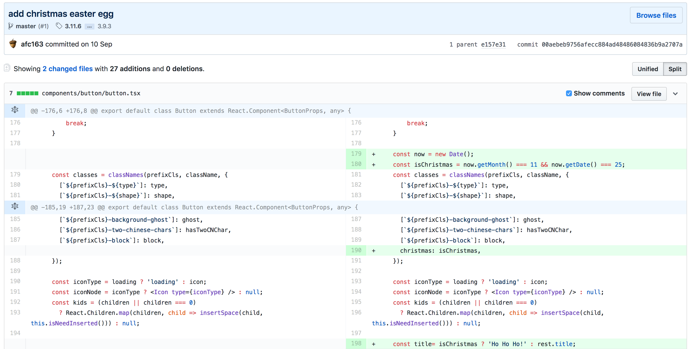
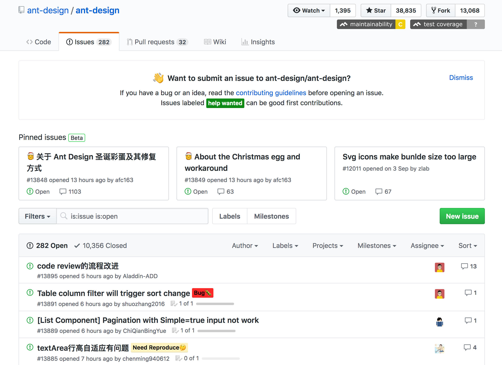

# The Ant Design Christmas Egg that Went Wrong

[Ant Design](https://ant.design/) is a design language comes with [a set of React comonents](https://ant.design/docs/react/introduce) open sourced by Alibaba's Ant Finance. One can assume its popularity by by looking at its [38837+ stargazers on Github](https://github.com/ant-design/ant-design/stargazers).

Just 4 minutes passed the midnight of the Chirstmas day, Beijing Time, [an issue](https://github.com/ant-design/ant-design/issues/13818) on the Ant Design Github repo started the wave of outcries of developers who had Ant Design in their dependencies on product, and suddenly found out there were snow on top of their UI buttons, and also change their titles to "Ho ho ho".

> There is snow on top of the buttons. This is not good for production!!!

This "Christmas Egg" was introduced at commit [`00aebeb`](https://github.com/ant-design/ant-design/commit/00aebeb9756afecc884ad48486084836b9a2707a), from one of the main maintainer of the repo. And the author actually left a comment in the commit, quoted "No need to show this in the changelog".

In fact, back in November, more than a month before this Chirstmas Egg activates, it was already spotted by a developer who created [an issue](https://github.com/ant-design/ant-design/issues/13098) on Github. It was [responded](https://github.com/ant-design/ant-design/issues/13098#issuecomment-441169987) by another maintainer of Ant Design with a proposed workaround by overriding the CSS.

This issue became heated with comments after many developers troubled by the behaviour of the Chirstmas Egg on the Chirstmas Day in their production environments.

Someone claims they have [lost their job](https://github.com/ant-design/ant-design/issues/13098#issuecomment-449786093) because of it. Someone also claims being fired as [their employer's clients are state-run institutions in China](https://www.theguardian.com/world/2018/dec/24/china-cracks-down-on-christmas-celebrations). The timing is sensitive and unfortunate as [local governments in China are cracking down Chirstmas celebrations](https://www.theguardian.com/world/2018/dec/24/china-cracks-down-on-christmas-celebrations).

The Ant Design team have pinned two issues about the Chirstmas Egg and its workaround, in [Chinese](https://github.com/ant-design/ant-design/issues/13848) and in [English](https://github.com/ant-design/ant-design/issues/13849).

